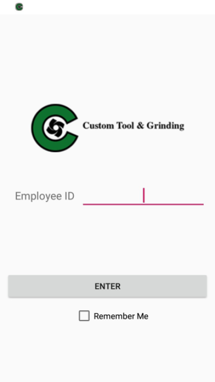
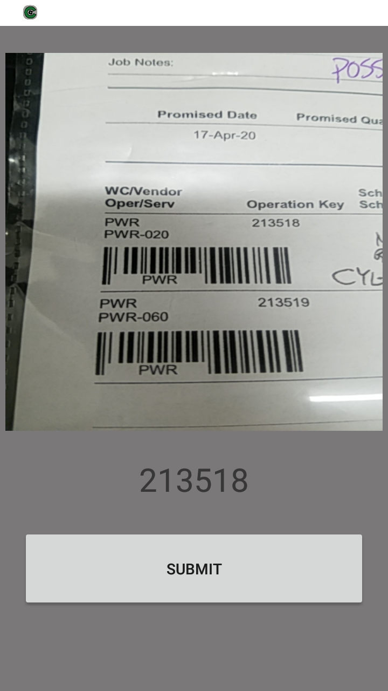
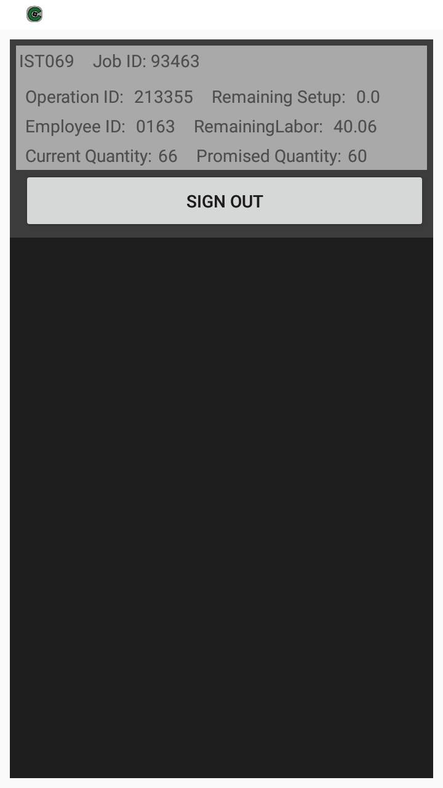
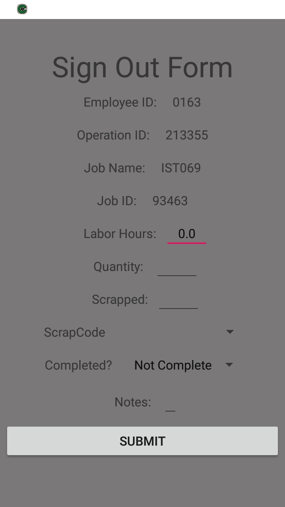

# Welcome/Sign In page 

##### Users use their employee identification number to sign into the app.

##### Users use this page to scan the barcode on the "traveler" documention.

##### This page is synced with the local database as users log in and out of jobs, the recycler view will update accordingly

##### When a user chooses a job to sign out of from the recylcer they are taken to the form that needs filled out. 

